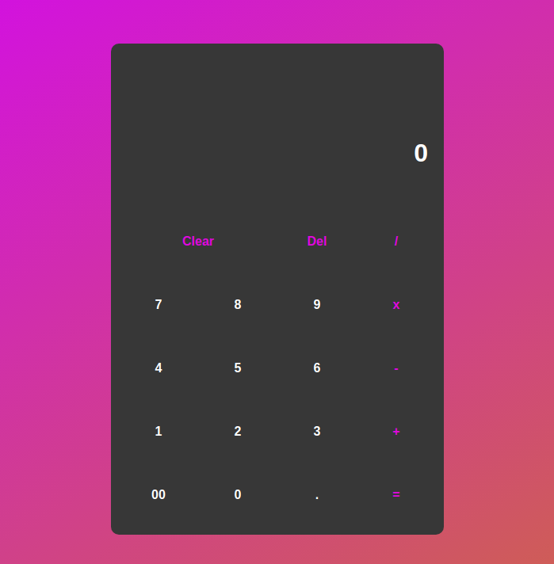

# calculator

Our final project is going to combine everything we've learned so far: we’re going to make an on-screen calculator using JavaScript, HTML, and CSS

## Built With

- HTML5
- CSS
- JavaScript

## Live Demo

[Live Demo Link](https://makspayne.github.io/calculator/)
